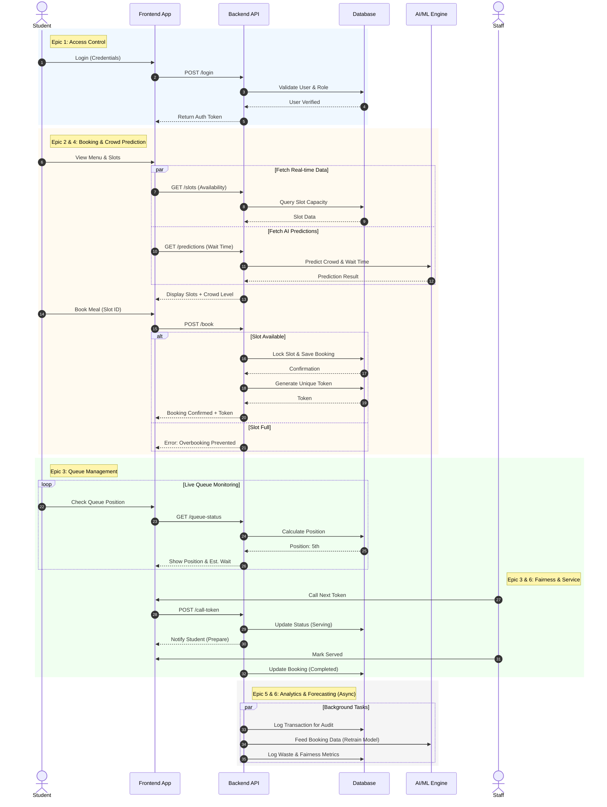

Multilingual Digital Marketplace and Decision-Support Platform for Indian Farmers

## Overview

AgriTech is a comprehensive MERN stack platform designed to revolutionize the agricultural supply chain by connecting farmers directly with buyers. By eliminating intermediaries, the platform ensures fair pricing for farmers and transparent sourcing for buyers. It incorporates modern web technologies to provide a seamless, real-time, and localized experience for users across different regions and languages.

## Problem Statement

In the traditional agricultural market, farmers usually depend on middlemen to sell their produce, which often reduces their profit margins. Many farmers do not get real-time information about market prices or demand, while consumers end up paying higher prices.

## UML Sequence Diagram

